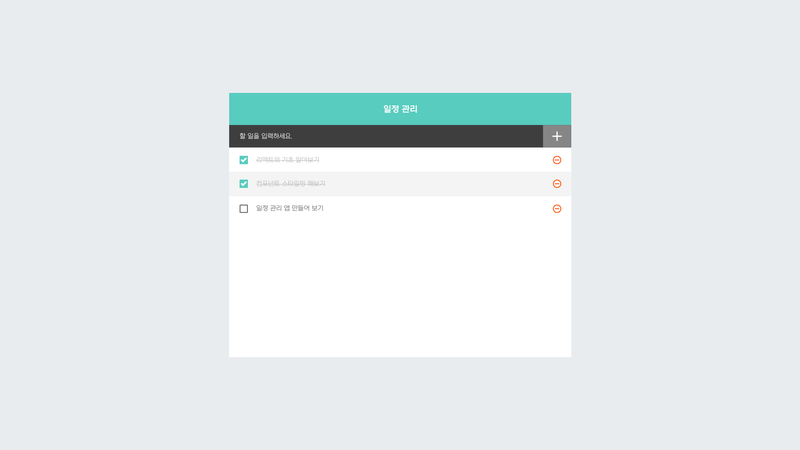
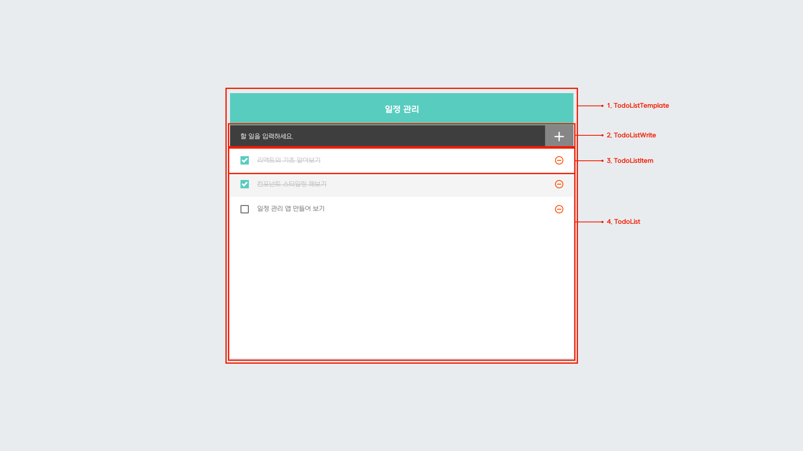

# 「리액트를 다루는 기술」 - 일정관리 웹 애플리케이션 만들기 편
## 1. 목표

### 1) 디자인
[사진1] 일정 관리 웹 애플리케이션 최종 디자인  

#### 컴포넌트 구성  
[사진2] 컴포넌트 구성  

1. TodoListTemplate : 화면을 가운데로 정렬시켜주며, 앱 타이틀을 보여준다.
2. TodoListWrite : 새로운 할 일을 입력하고 추가할 수 있는 컴포넌트입니다.
3. TodoList : 할 일 목록을 보여주는 컴포넌트. TodoListItem을 담는 역할을 한다.
4. TodoListItem : 하나의 할 일을 보여주는 컴포넌트.

### 2) 기능
1. 

## 사용 기술 및 라이브러리
1. create-react-app
2. styled-components (npm i styled-components)
3. react-icons (npm i react-icons)