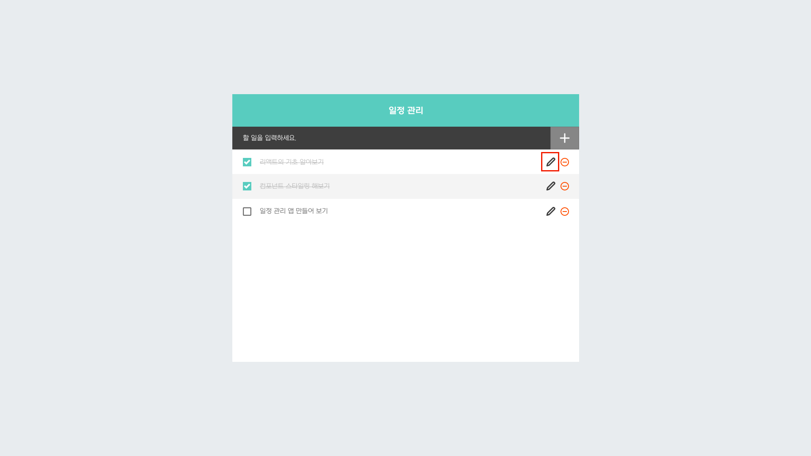
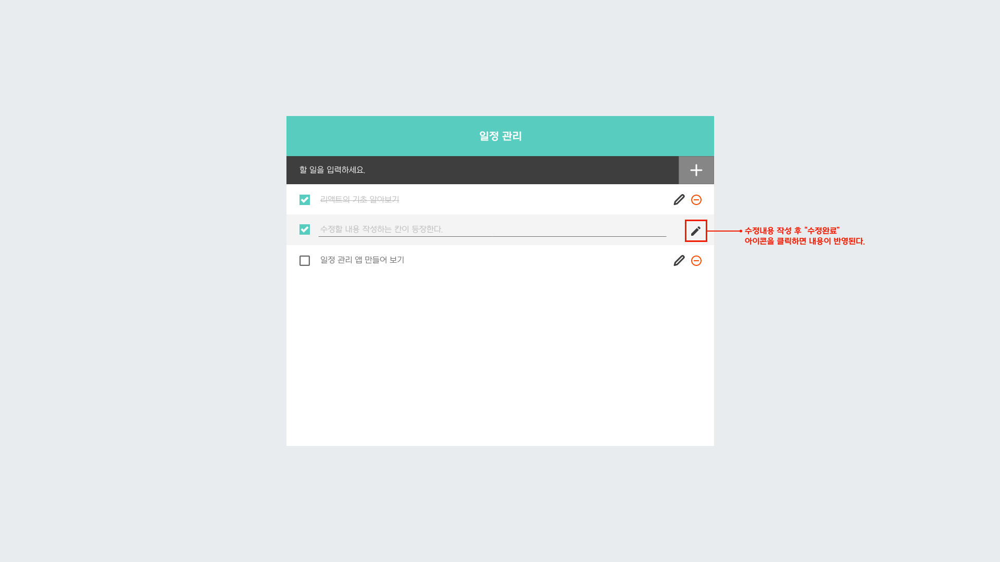

# 「리액트를 다루는 기술」 - 일정관리 웹 애플리케이션 만들기 편
## 1. 목표

### 1) 디자인
[사진1] 일정 관리 웹 애플리케이션 - 최종 디자인(예상)  

#### 컴포넌트 구성  
[사진2] 일정 관리 웹 애플리케이션 - 컴포넌트 구성  

1. TodoListTemplate : 화면을 가운데로 정렬시켜주며, 앱 타이틀을 보여준다.
2. TodoListWrite : 새로운 할 일을 입력하고 추가할 수 있는 컴포넌트입니다.
3. TodoListItem : 하나의 할 일을 보여주는 컴포넌트.
4. TodoList : 할 일 목록을 보여주는 컴포넌트. TodoListItem을 담는 역할을 한다.

#### 디자인 추가 요소  
[사진3] 일정 관리 웹 애플리케이션 - 수정 기능 아이콘 추가

[사진4] 일정 관리 웹 애플리케이션 - 수정 기능 아이콘을 클릭했을 경우, 수정 가능한 폼이 등장한다.

### 2) 기능
1. 할 일 작성 기능
2. 할 일 삭제 기능
3. 할 일 체크 토글 기능
4. 할 일 수정 기능 - 작성된 내용을 수정

## 2. 사용 기술 및 라이브러리
react  
1. create-react-app  
2. styled-components (npm i styled-components)  
3. react-icons (npm i react-icons)  

Database
- firebase (npm install firebase)

## 3. github 규칙
1. branch 네이밍 규칙 : "수정항목_구체적내용"  
`예) fix_styling_todolist_component` 
2. commit 메시지 규칙 : "수정항목 > 구체적인내용 - 추가설명"  
`예) add > Function of Insert Todo item`  

[표1] 구체적인 수정 항목

|항목|내용|
|------|---|
|add|기능, 환경설정 등 새로운 내용이 추가되었을 때에 사용|
|modified|기능, 환경설정 등의 내용이 변경되었을 때에 사용|
|styling|디자인 및 스타일 설정 및 변경 시에 사용|
|fix|버그 수정 관련 내용에 사용|
|test|테스트 케이스 추가 및 유닛테스트 추가 등 테스트 관련 내용에 사용|
